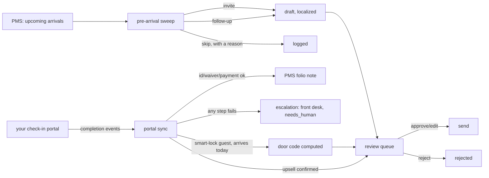

# Self Check-In AI - "The Gatekeeper"

Runs the entire check-in before the guest reaches the desk. It sends each guest a link to the hotel's own branded check-in portal at the right moment, chases anyone who hasn't finished as arrival gets close, and skips guests who already have.

## What it does

Runs the entire check-in before the guest reaches the desk. It sends each guest a link to the hotel's own branded check-in portal at the right moment, chases anyone who hasn't finished as arrival gets close, and skips guests who already have. In the portal the guest photographs their ID (checked against the booking name), signs the registration card and damage waiver, and pays the balance and city tax — or the AI simply authorizes the card to confirm it works. Every step writes straight to the PMS. The moment check-in completes, the guest lands on an upsell page — wine in the room, spa, yoga — and can charge extras to the card on file in one tap, straight onto the folio. On properties with smart locks it then handles the door end-to-end: a unique door code or mobile key per booking, issued when the room is actually ready, revoked at checkout, including the 'my code isn't working' resend loop — with a full access log.

## What it won't do

It never waves an unverified guest through: a name mismatch on the ID, a failed card authorization or an unsigned waiver stops the flow and hands that guest to the front desk. Where local law requires an in-person ID check it preps everything and leaves that one step to staff. It won't release a door code before the room is ready, and it never charges the card on file without the guest confirming that exact purchase. It can't fix a mechanical lock or open a door itself; lockouts outside the digital path route to your on-call human.

## Why it matters

Check-in admin is pure queue time, and the minutes after a completed check-in are the highest-intent upsell moment a hotel gets. Doing both digitally shortens the line for everyone — or removes the desk entirely for self-service properties and STR portfolios — while ancillary revenue books itself.

## What to expect

Guests arrive already checked in: ID verified, card on file, waiver signed, folio updated, door code issued and revoked on schedule — and a stream of pre-paid upsells attached before they ever reach the lobby.

The roster text above is quoted exactly as it appears on the demo platform's
agent menu - this repo does not promise more than that, and does not promise
less. Read "How it works" below for exactly which parts of that promise this
repo builds itself, and which part (the guest-facing portal) it expects you
to point at something else - the promise is bigger than one Python repo, and
we would rather say that plainly than quietly ship less than it implies.

## Who it's for

Independent hotels, guesthouses and small groups that already have (or want)
a branded online check-in step, and want the admin around it - who gets
invited, who gets chased, what the front desk needs to look at in person -
run by something other than a spreadsheet or a person's memory. It replaces
the "check who hasn't checked in, email them, update the PMS by hand" part of
a front-desk or reservations job, not the desk itself.

You will get the most from this repo if:

- You have a PMS or at least a CSV export of your reservations, with
  arrival/departure dates, a balance, and (if you charge one) a city tax
  figure per booking.
- You already have, or are commissioning, a guest-facing check-in portal
  (your own, or a vendor's) that can post completion events somewhere this
  agent reads - see "Connect your systems" below. This repo is the decision
  engine and the PMS sync behind that portal, not the portal's web pages.
- Guests write, or book, in more than one language.
- You are comfortable reviewing AI-drafted messages before they go out, at
  least at first - this ships in shadow mode and stays there until you say
  otherwise.

It is less of a fit if you have no plan to build or buy a guest-facing
check-in portal at all - without one, the sweep can still decide and draft
invites, but there is nothing to sync back from, and the door-code and
upsell halves of the promise never activate.

## How it works

Two engines, both fully deterministic - no model decides anything here, only
writes the sentence once a decision is already made (`docs/how-it-works.md`
has the full detail, the design decisions, and why).



### The two modes

`shadow` (default): the sweep drafts invites and follow-ups and queues them;
the sync leg computes everything and updates this agent's own tracking
tables, but every PMS folio note, every guest email and every door-code
message is blocked until a person approves it. `live`: an approved item is
really sent or posted. Nothing about the escalation path changes between
modes - a failed ID check or a declined card always goes to a person,
shadow or live.

### The review loop

Four kinds of item move through one queue: a drafted invite/follow-up email,
a door-code notice, an upsell to post to the folio, and an escalation (no
draft - a name mismatch, a declined card, an unsigned waiver, always
resolved in person). `workflows/80-review.md` covers all four.

### What runs when

| Job | Workflow | Cadence | What it does |
|---|---|---|---|
| Pre-arrival sweep | `workflows/10-checkin-sweep.md` (`tools/run.py`) | hourly | invite / follow-up / skip, drafts queued |
| Portal sync | `workflows/15-portal-sync.md` (`tools/portal_sync.py`) | every 15 minutes | applies portal events, escalates failures, computes door codes |
| Review queue | `workflows/80-review.md` | whenever a person is available | approve / edit / reject / send |

`make schedule ARGS="--all"` prints both jobs, already filled in with the
right absolute paths for this machine - see "Run it" below.

## What you need

| Item | Required? | Notes |
|---|---|---|
| A computer or small server that can run Python 3.11+ | Yes | Your laptop is fine to start; `workflows/90-go-live.md` covers scheduling it properly. |
| A Claude Code subscription, or your own Anthropic API key | Yes | The `interactive` provider uses the Claude Code session you already have open - zero extra cost. See "Run it" below. |
| A PMS, or at least a CSV export of your reservations | Recommended | Starts on `mock` fixtures; the `csv` adapter works with any PMS. |
| A mailbox to send invites, follow-ups and door codes from | Recommended | Starts on `mock` fixtures; connect a real one (IMAP or Gmail) when ready. |
| A guest-facing check-in portal that can post completion events | Recommended | This repo is the decision engine and the sync leg, not the portal - see "Connect your systems". |
| A smart-lock system, if you want real door codes | Optional | This repo computes a code and drafts the guest message either way; a lock vendor adapter is what makes the code actually work. |

Time estimate: 15 minutes to see the demo, half a day to connect a real PMS
and mailbox and fill in your property's `knowledge/` files, a few days of
watching the review queue before you would reasonably consider going live.

## Quick start (5 minutes, no credentials)

```bash
git clone https://github.com/th1-ai/self-check-in-ai.git self-check-in-ai
cd self-check-in-ai
make setup
make demo
```

You should see something like this (shortened):

```
Self Check-In AI demo - The Gatekeeper - 2026-09-01

=== Pre-arrival sweep (tools/run.py) ===

3 invites sent · 3 follow-ups chased · 4 stays deliberately left alone

  follow_up MH-3009   Meera Anand      arrives in 0 days, not started
  follow_up MH-3001   Lena Novak       arrives in 2 days, not started
  invite    MH-3010   Klara Vogel      arrives in 3 days, inside the 30-day invite window
  follow_up MH-3002   Beatriz Neves    arrives in 4 days, everything done except payment
  invite    MH-3003   Haruto Sato      arrives in 6 days, inside the 30-day invite window
  invite    MH-3004   Isabela Duarte   arrives in 12 days, inside the 30-day invite window
  skip      MH-3005   Noah Fischer     already checked in online - nothing more to send
  skip      MH-3006   Sofia Rossi      already checked in online - nothing more to send
  skip      MH-3008   Julieta Marques  link is out but arrival is 9 days away - chasing starts at D-5
  skip      MH-3007   Elin Karlsson    outside the 30-day window (arrives in 38 days) - the invite goes out at D-30

Nothing was sent: mode is shadow, and demo never calls send() at all.
Run `make review` to see the drafts, or read workflows/10-checkin-sweep.md.

=== Portal sync (tools/portal_sync.py) ===

  MH-3009    id_verified
  MH-3009    waiver_signed
  MH-3009    card_authorized
  MH-3002    payment
  MH-3004    id_check_failed  -> escalated <id>
  MH-3006    upsell_queued
  MH-3001    payment_failed  -> escalated <id>

2 portal event(s) were handed to the front desk - see `python3 tools/review.py list --status needs_human --kind checkin_escalation`.
Every folio note, door-code message and guest email above is queued, not sent - see docs/safety.md.

DEMO OK — 13 items processed, 8 drafted, 0 sent (shadow)
```

Every guest above is invented - a fictional "Hotel Aurora" - so you can see
exactly how Self Check-In AI decides, drafts, escalates and computes a door
code before it ever touches your real PMS. Note the two escalations: a name
mismatch and a declined card, both handed to the front desk instead of
guessed through - that is the whole point of this agent's `cant` promise.
Next: open `claude` in this folder and follow "Set up with Claude Code"
below.

## Set up with Claude Code

Open `claude` in this folder. Paste each prompt below in order - Claude will
follow the named workflow file, which tells it exactly which tools to run and
what to check.

**Phase 1 - first run.**

> Read `workflows/00-setup.md` and walk me through it. I have not run this
> agent before.

**Phase 2 - the pre-arrival sweep.**

> Read `workflows/10-checkin-sweep.md`. Run one pass and show me what Self
> Check-In AI decided for each upcoming arrival, in plain language.

**Phase 3 - the portal sync leg.**

> Read `workflows/15-portal-sync.md` and help me connect our check-in
> portal's completion events to `data/imports/checkin_portal_events.jsonl` -
> or, if we do not have a portal yet, explain what we would need to build or
> buy.

**Phase 4 - the review queue.**

> Read `workflows/80-review.md`. Show me what is waiting for me, one at a
> time, and act on my decisions.

**Phase 5 - going live.**

> Read `workflows/90-go-live.md`. Go through the checklist with me honestly -
> do not recommend going live until it is genuinely true.

You can also just run the agent directly - `/self-check-in-ai` in this
folder runs both loops and works the queue in one command; see
`.claude/skills/self-check-in-ai/SKILL.md`.

## Connect your systems

Full detail, including the "implement your own" recipe, is in
`docs/integrations.md`. This section covers only what Self Check-In AI
itself uses.

### PMS - `systems.pms.adapter` in `config/hotel.yaml`

| Adapter | Status | Needs |
|---|---|---|
| `mock` | universal | nothing - reads `fixtures/hotel/reservations.json` |
| `csv` | universal | a CSV export in `data/imports/` - works with any PMS |
| `cloudbeds` | built | OAuth app + refresh token |
| `cli` | universal | a JSON-speaking vendor command line tool |

### Guest check-in portal - not a `systems.*` adapter

This repo does not build the guest-facing portal (ID photo, signature,
card). It reads completion events from
`data/imports/checkin_portal_events.jsonl` - one JSON object per line,
appended by your own portal or a webhook relay. See the "Guest check-in
portal" section of `docs/integrations.md` for the exact event shapes.

### Email - `systems.email.adapter`

| Adapter | Status | Needs |
|---|---|---|
| `mock` | universal | nothing - reads `fixtures/inbound/*.json` |
| `imap` | universal | mailbox + app password - any provider |
| `gmail` | built | Google OAuth desktop client |

This agent only sends (invites, follow-ups, door-code notices); it never
reads a guest inbox.

### Locks - `core.adapters.get_stub("locks", settings)`

**Stub, always.** The code is computed for real; programming it into an
actual lock needs a vendor adapter you build (or ask this Claude session to
build) - named vendors and the recipe are in the "Locks" section of
`docs/integrations.md`. Without one, a computed code becomes a drafted guest
message for a person to apply by hand.

### Everything else

`pos`, `accounting`, `reviews`, `calendar`, `payments` and `procurement` are
stubs this agent does not use at all.

## Run it

```bash
make run                                  # the pre-arrival sweep, one pass
make run ARGS="--dry-run"                 # compute everything, write nothing
make run ARGS="--provider mock"           # rehearse without a model call
make watch                                # keep the sweep running on the configured interval
python3 tools/portal_sync.py --once       # apply new portal completion events
python3 tools/portal_sync.py --once --dry-run
```

**Scheduling.** `config/agent.yaml`'s `schedule:` block names both jobs this
agent needs - `sweep` (hourly) and `portal_sync` (every 15 minutes, since
guests expect a prompt door code) - each with its own real command. Print
both, already filled in with the right absolute paths for this machine,
with:

```bash
make schedule ARGS="--all"
```

Paste that straight into `crontab -e`. `scheduler/crontab.example`,
`scheduler/launchd.example.plist` and `scheduler/systemd.example.service`
plus `scheduler/systemd.example.timer` have one hand-editable example each,
for a Mac, a Linux box, or a VPS, if you would rather not use `--all`.

**Subscription or API.** `llm.provider: interactive` or `claude-code` runs on
the Claude Code subscription you already pay for - genuinely the cheapest way
to run a small property's agent, with the caveat that Anthropic's usage
policy governs automated use of a personal subscription (a handful of
scheduled runs a day is normal; hammering it around the clock is not).
`llm.provider: anthropic` uses your own API key, bills per token, and is the
right choice for production volume. `make report` shows what you are
actually spending either way - see `docs/safety.md` for the full honest
note.

## Go live

Shadow mode is the default and stays the default until you change it. The
full checklist - real config filled in, a few days of real review behind
you, the AI-disclosure line added, a real PMS connected, every past
escalation actually resolved and closed - is in `workflows/90-go-live.md`.
In short:

```yaml
# config/hotel.yaml
mode: live
```

Going live means an **approved** item now actually sends or posts - it does
not change what needs approval, and it does not change the escalation path
at all. `review.require_approval_for` still lists `send_email` and
`pms_write` by default. Going back to shadow (`mode: shadow`, or
`AGENT_MODE=shadow` in `.env` for one run) stops every outbound action and
every PMS write immediately, mid-schedule.

## Guardrails & safety

**Never waves an unverified guest through.** A name mismatch, a declined
card, or an unsigned waiver always escalates to the front desk - never
guessed through, never retried automatically. Full detail:
`docs/safety.md`.

- `mode: shadow` is the default and the global kill switch - nothing is ever
  sent or posted while it is on, except an item a human explicitly approved.
- Reply only in `hotel.languages`; a guest in another language gets the
  default-language draft, flagged `needs_human`.
- Money is always shown in `hotel.currency` - never a hardcoded EUR/USD.
- Card numbers are redacted on ingestion (`core/redact.py`), always on.
- A door code is never released before ID, waiver and payment have all
  succeeded, and this repo never programs a real lock - `systems.locks` is
  always a stub.
- An upsell is never charged without the guest's own confirmed tap in the
  portal, and the folio post still waits for a human approval on top of
  that.
- Every guest-facing message includes an AI-disclosure line (EU AI Act
  Article 50).

Full detail, including the subscription-vs-API note and the GDPR summary:
`docs/safety.md`.

## Sub-agents in this repo

None. The builder brief lists no children for this agent. The behavioural
spec it was built from names a related capability, "The Locksmith"
(contractor codes, the building-wide audit feed, revoking a code) that
deliberately lives with a different, housekeeping/access-control agent -
this repo only ever issues one guest's own stay-length code. See
`docs/sub-agents.md`.

## Customising

**`knowledge/`.** The agent's memory of your property -
`knowledge/property.md`, `knowledge/faq.md`, `knowledge/checkin-policy.md`,
`knowledge/signature.md`. See `knowledge/README.md` for how to write each
one well. `knowledge/checkin-policy.md` covers your local ID-check law, the
waiver text, and which lock vendor you would wire up - read it before you
change `rules.require-id`.

**`prompts/`.** `prompts/invite.md` and `prompts/doorcode.md` are plain
markdown with `{{var}}` placeholders - edit them directly to change the
tone, or add a language your model already reads and writes. The JSON schema
each one must answer to lives next to it in `prompts/schemas/`.

**`config/agent.yaml`.** The `windows:` block (invite at D-30, chase from
D-5, one nudge per 48 hours, room ready at 14:00), the `rules:` block (six
on/off switches - turn `invite-window-30` off and re-run the sweep to see
the effect immediately), and the `upsells:` catalogue.

**Adding a language.** One place: `hotel.languages` in `config/hotel.yaml`.
Both LLM tasks already handle any language your model can read and write -
nothing in Python needs to change. A guest whose language is not in that
list gets the default-language draft and a `needs_human` flag instead of a
guess.

**The upsell catalogue.** `config/agent.yaml: upsells` (slug, title, price).
`knowledge/checkin-policy.md`'s guest-facing description should match each
`title`.

## Troubleshooting & FAQ

Full list in `workflows/99-troubleshooting.md`. The most common ones:

**`make doctor` shows a FAIL.** Every line has a fix hint right under it -
read it before doing anything else.

**`make run` or `python3 tools/portal_sync.py` exits with code 3.** Not an
error - `llm.provider: interactive` is waiting for you to answer a parked
prompt in `data/pending/`.

**A portal event says "unknown reservation - run the sweep first".** This
agent only tracks a reservation once the sweep has seen it. Run
`workflows/10-checkin-sweep.md` for that arrival first.

**An escalation will not "send".** It has no draft - there is nothing to
send. Resolve it in person, then close it with
`python3 tools/review.py reject <id> --reason "resolved: ..."`.

**Can I run this without a guest-facing portal at all?** Yes, but only
half the promise activates - the sweep still decides and drafts invites and
follow-ups, but nothing ever completes a check-in, posts an upsell, or
computes a door code, because there is no portal reporting those events
back. See `docs/how-it-works.md` "Scope".

## Measuring the benefit

`make report` shows arrivals in the invite window, the online check-in rate,
how many guests are still mid-portal, upsell revenue actually posted,
desk minutes saved, door codes issued, and escalations - all computed from
`data/agent.db`, nothing phoned home. See `docs/benefits.md` for what each
number means and the honest caveats (the -70% figure is a planning
estimate, not a measurement of your property, and several numbers depend on
a real portal being wired up and used).

```bash
make report
python3 tools/report.py --json
```

## About

Built by [TH1](https://th1.ai) - we build and run AI agents for
independent hotels. This repo is free to use, modify and self-host under the
MIT licence (see `LICENSE`).

Want it run for you, tuned to your property, with someone accountable for
the result - and the guest-facing portal built and hosted too?
[Talk to TH1](https://th1.ai).

**Changelog**

- v1.0 - initial release: the pre-arrival sweep and the portal sync leg,
  including the escalation path the source demo never implemented.
