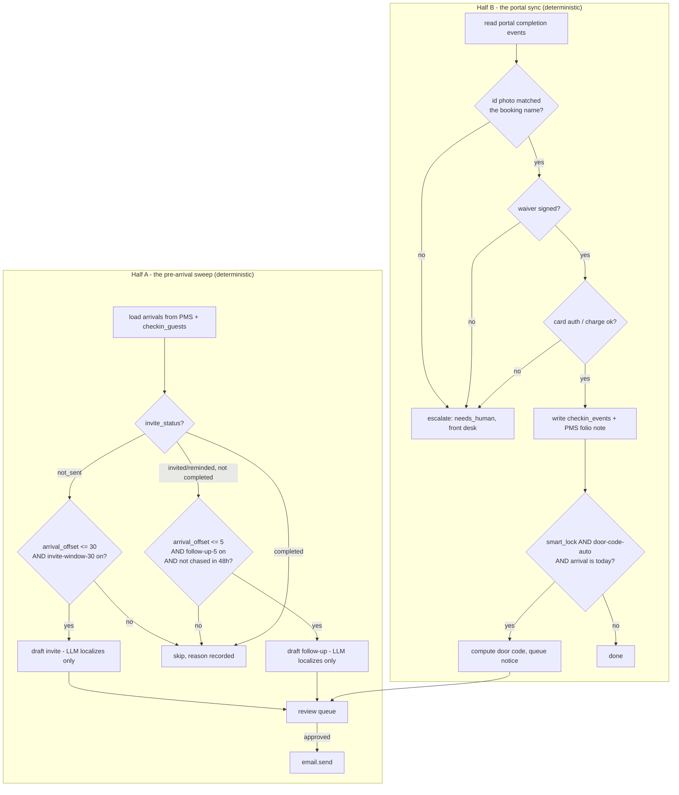

# How Self Check-In AI works

Self Check-In AI ("The Gatekeeper") has two halves that share one set of
records: a **deterministic sweep** that decides who gets an invite link or a
chase, and a **sync leg** that reads back what the guest did in your own
check-in portal and writes it to the PMS. Both halves are plain rules and
formulas — no model call decides anything. The only place a model is used is
writing the guest-facing sentence in the right language once a decision is
already made.

## Scope: what this repo builds, and what it does not

The demo platform's `/check-in` page is a full web app: a phone-shaped guest
portal that captures an ID photo, a signature and a card, and shows a live
door-code screen. This repo is the **hotel-side agent**, not a guest-facing web
app — it is a Python agent that runs on the hotel's own machine or server. It
implements the two backend legs of the pattern the source code uses (invite →
portal → sync):

1. **Invite.** Decide who gets the check-in link and when, draft the email,
   queue it for approval, send it once approved (`tools/sweep.py`,
   `tools/checkin.py`, `tools/run.py`).
2. **Sync.** Read back what happened in the portal — ID result, signature,
   payment, an upsell tap — and write it to the PMS folio, the audit trail,
   and (for smart-lock rooms) a computed door code (`tools/portal_sync.py`).

**The portal itself (leg 2 of 3) is out of scope for this repo.** Capturing an
ID photo, a signature and a card number is a real web application with its
own PCI-DSS and identity-document handling obligations; building and hosting
that is a separate project. This agent expects the hotel's own portal (built
by TH1 as a follow-on, or any third-party check-in product) to POST or export
its completion events into the format `tools/portal_sync.py` reads — see
`docs/integrations.md#guest-check-in-portal`. Everything downstream of that —
matching the event to a reservation, updating the PMS, deciding on a door
code, drafting the confirmation — is real and tested here.

This is a narrower promise than the roster's `does` text taken literally
("every step writes straight to the PMS", "the AI simply authorizes the card").
Read those lines as: *this agent is the system of record and the decision
engine behind that promise; the card entry and ID capture screens are a portal
you point it at, not code in this repository.*

## The two engines



`tools/sweep.py:run_sweep()` is a pure function — no I/O, exactly the
`checkin-engine.ts` header's promise ("the LLM never touches these
decisions") ported to Python. `tools/checkin.py` and `tools/portal_sync.py`
are the I/O shell around it: load data, call the pure function, act on the
result.

## Constants (all in `config/agent.yaml: windows`, defaults match the source)

```
invite_window_days  = 30   # the invite goes out once arrival is inside this window
chase_window_days   = 5    # unfinished check-ins get chased inside this window
chase_cooldown_days = 2    # never more than one nudge per 48 hours
room_ready_hour     = 14   # smart-lock rooms are ready, and codes activate, at this hour
desk_minutes_saved  = 6    # a completed check-in saves about this many desk minutes
```

## Deciding invite / follow-up / skip

`tools/sweep.py:run_sweep(guests, today, rules)` — for each guest, in
`arrival_offset` order:

1. `invite_status == "not_sent"`:
   - `arrival_offset > invite_window_days` → skip, *"outside the
     {window}-day window (arrives in {N} days) — the invite goes out at
     D-{window}"*.
   - rule `invite-window-30` off → skip, *"inside the window, but automatic
     invites are off by rule — the link stays queued for a human"*.
   - otherwise → **invite**.
2. else, not `completed`:
   - `arrival_offset > chase_window_days` → skip, *"link is out but arrival is
     {N} days away — chasing starts at D-{window}"*.
   - rule `follow-up-5` off → skip, *"unfinished check-in inside the chase
     window, but follow-ups are off by rule"*.
   - chased within the last `chase_cooldown_days` → skip, *"already nudged
     within the last 48 hours — one chase per two days, never more"*.
   - otherwise → **follow-up**.
3. `completed` → skip, *"already checked in online"* (with what was verified).

This is a direct port of the source `runCheckinSweep()` step order — see
`specs/self-check-in-ai.md` section 3 for the verbatim skip-reason wording,
which `tools/sweep.py` reproduces exactly (word for word, formatted per
guest).

## Deciding the review status of a drafted message

`tools/checkin.py:needs_human_for_message()` — a plain rule:

```
needs_human = guest.language is set AND guest.language not in hotel.languages
```

That is the only automatic escalation for an invite/follow-up/door-code
message — see "Reply only in the hotel's languages" in the family rules.
Everything else in `cant` (a name mismatch, a failed card, an unsigned
waiver) is a **portal-sync-time** escalation, not a drafting-time one — see
below.

## The portal sync leg: the failure branches the demo left out

`specs/self-check-in-ai.md` section 11 flags that the demo platform never
built the "hand this guest to the front desk" path at all — the scripted demo
ID always matches and the demo card always works. This repo builds it for
real, because it is the entire content of the roster's `cant` promise:

`tools/portal_sync.py:apply_event()` reads one portal completion event and:

| Event | On success | On failure |
|---|---|---|
| `id_check` | `id_status: verified`, event `id_verified` | `id_status: failed`, item `needs_human`, staff notified: *"ID name mismatch: booking says {booking_name}, ID says {id_name}"* |
| `waiver` | `waiver_signed: true`, event `waiver_signed` | item `needs_human`: *"guest did not sign the registration card / damage waiver"* |
| `payment` | `card_status: authorized\|charged`, event `card_authorized`/`payment` + a PMS folio note | item `needs_human`: *"card authorization failed"* / *"payment failed"* |
| `upsell` | event `folio_charge`, PMS folio note, `checkin_guests.upsells_total` increments | ignored (guest did not confirm) |

A guest only reaches `portal_step: completed` once id_check, waiver and
payment have all succeeded — the same linear gate the source portal enforces,
just checked here instead of in a web UI. Any failure creates a
`checkin_escalation` item (`kind="checkin_escalation"`, `needs_human`) and, if
`systems.messaging` is configured, a staff notification — never a guest-facing
message. **This is where "hands that guest to the front desk" actually
happens.**

## Door codes: honest about hardware

Once id_check + waiver + payment have all succeeded, `tools/portal_sync.py`
checks the same eligibility rule as the source:

```
eligible = guest.smart_lock AND rules["door-code-auto"] AND arrival_offset == 0
```

If eligible, `tools/sweep.py:door_code_for(room_number)` computes
`((room * 7919) mod 9000) + 1000` — a stable, deterministic, fake-looking code
derived only from the room number, exactly like the source. **Computing that
number is the only part of "issuing a door code" this repo can do on its
own.** Actually programming a real electronic lock needs a live connection to
the hotel's own lock vendor, which this repo does not have:

- `core.adapters.get_stub("locks", settings)` is called with the computed
  code; because `locks` is a **stub** family (ARCHITECTURE.md section 5), it
  raises `AdapterNotImplemented` naming the vendor recipe in
  `docs/integrations.md#locks`.
- `tools/portal_sync.py` catches that and queues a `checkin_doorcode` item
  instead of crashing: a drafted guest message with the code and the
  `room_ready_hour`-gated activation wording (*"activates at 2:00 PM"* before
  the hour, *"is active"* after it), for a person to either send once they
  have programmed the physical lock, or to hand to whichever system does that
  automatically once you wire it.
- `docs/integrations.md` names the lock vendors a hotel would actually need to
  wire (Salto KS, ASSA ABLOY Visionline/Vostio, dormakaba, Akiles, Nuki,
  RemoteLock, TTLock, Igloohome) and the five-step recipe
  (`core/adapters/base.py:Locks`) for adding one.

This matches `cant`: *"it can't fix a mechanical lock or open a door itself."*
The code value is real and correct; delivering it into a working lock is not.

## Idempotency

- **Invite/follow-up dedup.** Each drafted message is an `items` row keyed
  `(source="checkin", external_id=f"{res_ref}:{kind}:{today}")` — unique on
  `(source, external_id)` (`core.store`), so a sweep that runs twice on the
  same day never queues the same invite twice. `checkin_guests.invite_status`
  is only advanced to `invited`/`reminded` once the item is actually queued.
- **Guest tracking row.** `checkin_guests` is unique on `res_ref`
  (`store.migrate()`'s own schema, not the generic `items` table) — a sweep
  re-run finds the existing row and updates it rather than creating a
  duplicate guest.
- **Portal events.** Each event carries its own `event_id`; `checkin_events`
  is unique on `event_id`, so re-running `tools/portal_sync.py` over the same
  export file is a no-op the second time (`Store.upsert_unique`-style ledger,
  see `tools/store_ext.py`). The `portal_sync:file_offset` cursor
  (`tools/portal_sync.py:_real_events()`/`one_pass()`) only advances past an
  event once that specific event has been fully applied — never for the
  whole batch up front. If `apply_event()` pends on `LLMPendingInteractive`
  partway through a batch, the cursor stays at the end of the last event
  that DID complete, so the next `--once` re-reads from there — the pended
  event included, nothing after it dropped. Advancing the cursor to
  end-of-file as soon as the file was read (before any event in the batch
  was applied) was SIMULATION.md finding 1: a pause on event 5 of 11 lost
  events 5–11 outright.
- **Reserving the marker after the stage that can pend.** The draft (LLM)
  call happens *before* `invite_status` is advanced and *before* the
  `checkin_events` row is written — so if `llm.provider: interactive` pends
  mid-draft, a retry finds `invite_status` still `not_sent` and drafts again,
  rather than silently skipping the guest forever. See the regression test
  `test_retry_after_draft_pended_resumes_the_same_guest`.
- **Cache stage results in `_`-prefixed payload keys.** `tools/checkin.py:draft_and_queue_doorcode()`
  stashes the computed code (`_door_code`) and room-ready facts (`_door_code_ready`,
  `_door_code_ready_hour`) on the door-code item's own payload the moment the
  item is created — before the LLM call that can pend — so `Store.upsert_item()`'s
  `_`-prefix preservation keeps them there across a retry.
- **Door codes: reserve the marker after the stage that can pend.**
  `door_code_for()` is a pure function of the room number — computing it
  twice is harmless by construction — but `checkin_guests.door_code` (the
  "already issued" marker `tools/checkin.py:maybe_issue_door_code()` gates
  on) is written only ONCE, and only *after* `draft_and_queue_doorcode()`
  returns a resolved item, never before. If the draft call pends
  (`llm.provider: interactive`), the exception propagates before that write
  and before the audit event and lock-stub attempt; a retry finds
  `door_code` still empty, recomputes the same code and resumes the SAME
  item (matched by `external_id`) instead of creating a new one or
  short-circuiting on "already issued" with an empty draft. Writing the
  marker first was exactly the bug in SIMULATION.md finding 2 — see the
  regression test `test_door_code_pend_then_retry_drafts_instead_of_short_circuiting`.

## What runs when

| Job | Workflow | Cadence | What it does |
|---|---|---|---|
| Pre-arrival sweep | `workflows/10-checkin-sweep.md` (`tools/run.py`) | hourly (`config/agent.yaml: schedule.sweep`) | invite / chase / skip, per guest, drafts queued |
| Portal sync | `workflows/15-portal-sync.md` (`tools/portal_sync.py`) | every 15 minutes (`schedule.portal_sync`) | reads portal completion events, updates PMS + `checkin_guests`, computes door codes, queues escalations |
| Review queue | `workflows/80-review.md` (`tools/review.py`) | whenever a person is available | approve / edit / reject / send |
| Report | — (`tools/report.py`) | on demand, or a daily digest cron entry | KPI strip: arrivals, checked-in %, awaiting completion, upsell revenue, desk minutes saved |

`make schedule ARGS="--all"` prints one ready-to-install snippet per row
above — see README section 9.

## Modes

`shadow` (default): the sweep drafts invites/follow-ups and queues them; the
sync leg computes everything and writes to `checkin_guests`/`checkin_events`
(the agent's own tables, not a guest-facing or PMS write) but the PMS folio
note, the guest-facing door-code message and every email are all blocked by
`core.review.assert_write_allowed` until a human approves. `live`: an
approved message can really be sent, and an approved PMS note can really be
written. Nothing about the escalation path or the language gate changes
between modes.

## Design decisions where the spec or the demo was silent

1. **Failure branches are built, not simulated.** Section 11.1 of the spec
   names this as the biggest gap between the demo and the promise. This repo
   builds `id_check`/`waiver`/`payment` failure as first-class escalations
   (see above) because it is literally what `cant` describes.
2. **`invited_at` is a real timestamp, not a day-granular integer.** Section
   11.9 flags the source's `invited_offset` integer as unable to express "20
   hours ago." `checkin_guests.invited_at` here is an ISO timestamp, so the
   48-hour cooldown (`chase_cooldown_days`) is checked in hours, not days.
3. **The kind-literal bug is not reproduced.** Section 11.4 flags a literal
   mismatch in the source (`"issued"` vs `"issue"`) that made a guest's own
   door code un-revoke-able through the Housekeeping UI. This repo's
   `checkin_events.kind` values are `door_code_issued` (an audit record) and,
   separately, calls `locks.issue_key()`/would call `locks.revoke_key()` — the
   actual verb the Locks adapter interface uses — so a real Locks
   implementation does not inherit that bug.
4. **The three-competing-windows problem (section 11.7) is out of scope here
   by design**, not by oversight: this repo tracks its own `checkin_guests`
   table, keyed by `res_ref`, and does not attempt to reconcile with any other
   agent's guest-journey table. A hotel running both this agent and a
   marketing/journey agent against the same PMS should pick one owner for the
   check-in link and turn invites off in the other.
5. **Upsell attribution stays local** (section 11.8): `checkin_guests.upsells_total`
   and the `folio_charge` events are this agent's own ledger. `docs/benefits.md`
   says plainly that this does not merge with any other agent's ancillary
   revenue numbers.
6. **No sub-agents folded in.** The brief lists none. The Locksmith's other
   half — contractor codes, the revoke flow, the audit feed across every lock
   in the building — belongs to a housekeeping/access-control agent, not this
   one; this repo only ever issues a guest's own stay-length code. See
   `docs/sub-agents.md`.
7. **No coach layer.** The brief marks `coach: no`. Edits made in the review
   queue are still recorded to `learnings` (`core/review.py:edit()`) for a
   future coach layer to read; nothing here turns them into prompt rules
   automatically.

## Where core stops and this agent starts

Everything in `core/` is byte-identical to `factory/core/` (ARCHITECTURE.md
section 2) and shared by every repo in this family. Everything in `tools/`,
`prompts/`, `fixtures/`, `workflows/`, `knowledge/*.example.md` beyond the
scaffold, and `config/agent.example.yaml` is this agent's own.
